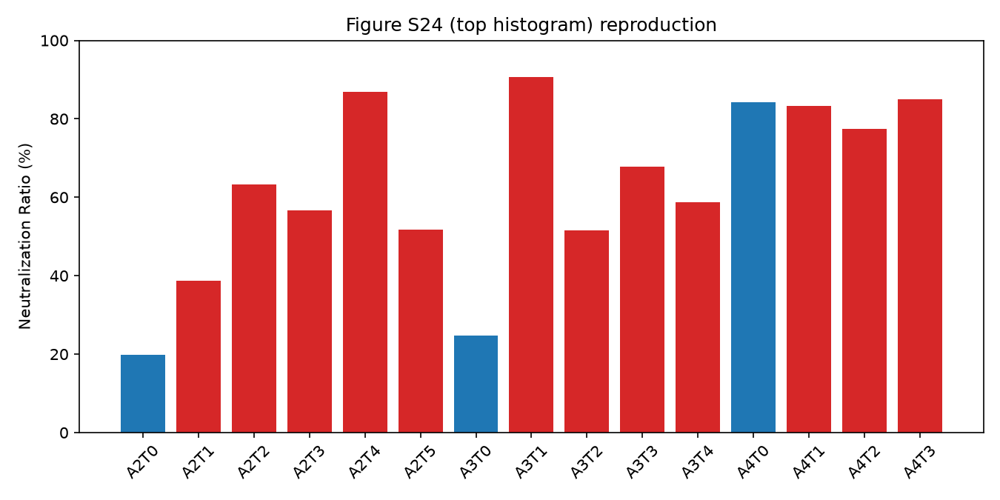

# T5ProtChem + XGBoost PPI/CPI Affinity Prediction

A "Boost" pKd (binding affinity) predictor: mean-pooled embeddings from a
**raw, never fine-tuned** T5ProtChem-native protein/molecule encoder, fed
into an XGBoost regressor. Trained on a pooled CPI (compound-protein
interaction) + PPI (protein-protein interaction) dataset, with a
leakage-conscious "pure" random split.

## Model

- **Encoder**: T5ProtChem's native char-level T5 encoder (`use_lora=False`),
  constructed directly from the raw pretrained checkpoint — **not**
  contact-map pretrained, **not** pKd fine-tuned. Both sides of a pair
  (protein sequence / small-molecule SMILES) are mean-pooled independently
  over their token embeddings and concatenated into a single feature vector.
- **Regressor**: XGBoost (`XGBRegressor`, 1000 max estimators, 30-round early
  stopping on a held-out validation set).
- **No data augmentation / no CPI:PPI oversampling** ("unbalanced" condition)
  — the training set is used as-is.

## Data / split

Source datasets: BindingDB, PDB-bind (protein-ligand and protein-protein
subsets), PPB-Affinity, Human/C. elegans, Negatome (see the wider project's
data curation pipeline — not included in this repo).

Splitting is two-staged:

1. `scripts/make_pure_random_split_uniqueonly.py` builds a **plain
   row-level random split** (no protein-sequence-identity grouping, no
   CPI:PPI balancing) of the pooled CPI/PPI data — but with one fix applied
   *before* splitting: rows whose (moleculeA, moleculeB) pair matches
   another row's swapped (moleculeB, moleculeA) pair (both listing the same
   interaction in the two possible chain orders) are deduplicated first, so
   no single underlying interaction can leak across train/val/test through
   that route.
2. `scripts/build_seed51_unbalanced_model.py` reconstructs that deduplicated
   pool and re-partitions it into a **fresh** 80/10/10 train/val/test split
   with `random.Random(51)` (seed 51) — this was the single best-performing
   seed found in a 10-seed robustness sweep (see Caveat below).

The resulting split CSVs are included directly under `data/`:

- `data/split_pure_random_uniqueonly_seed51_train.csv`
- `data/split_pure_random_uniqueonly_seed51_val.csv`
- `data/split_pure_random_uniqueonly_seed51_test.csv`

## Results

`scripts/build_seed51_unbalanced_model.py` (see `results/metrics.json`):

| | overall | CPI | PPI |
|---|---|---|---|
| val Pearson r | 0.797 | 0.759 | 0.817 |
| test Pearson r | 0.783 | 0.752 | 0.785 |
| val RMSE | 1.089 | 1.049 | 1.317 |
| test RMSE | 1.125 | 1.087 | 1.354 |


### External validation (out-of-domain)

Predictions for an independent, out-of-domain polymer-peptide dataset
(results in `results/predicted_pKa_KanM_T5ProtChem_raw_uniqueonly_seed51_unbalanced.csv`),
correlated against an experimentally measured neutralization-ratio readout
for the same pairs (`results/hoshino_correlation.json`):

| | Pearson r | p |
|---|---|---|
| vs. neutralization ratio (n=15) | 0.618 | 0.0141 |




**Caveat**: a 10-seed robustness check (reshuffling the train/val/test
partition 10 times and refitting, no augmentation) found this external
correlation is **not stable in general** — across the 10 seeds the mean
Pearson r was 0.18 (not significantly different from zero), ranging from
-0.53 to +0.62. Seed 51 (used here) happened to land at the high end of
that range; other seeds showed weak, near-zero, or even negative
correlations. In-domain (val/test) performance was consistently strong and
stable across all seeds. Treat the external-validation number above as a
best-case illustration, not a validated, universally reproducible effect.

## Reproducing

```bash
python scripts/make_pure_random_split_uniqueonly.py     # builds the base deduplicated CPI/PPI pool + split
python scripts/build_seed51_unbalanced_model.py          # re-partitions with seed=51, trains, evaluates, predicts on Hoshino data, plots
python scripts/plot_figureS24_reproduction.py             # plots results/figureS24_reproduction.png
```

Scripts reference absolute paths from the original project layout (T5ProtChem
checkpoint and an external polymer-affinity validation CSV) — update the
path constants at the top of each script for your own environment. The split
CSVs are included under `data/` (see above); the raw source datasets used to
build them, the T5ProtChem pretrained checkpoint, and the external validation
dataset are not included in this repo.
