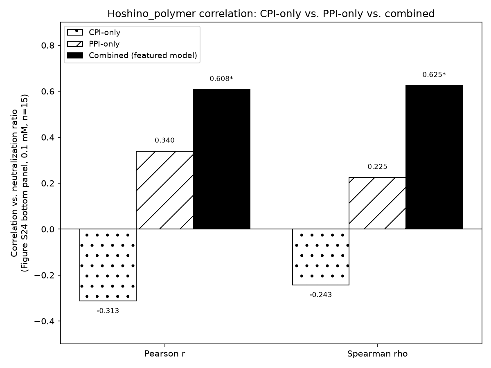

# T5ProtChem + XGBoost PPI/CPI Affinity Prediction

A "Boost" pKd (binding affinity) predictor: mean-pooled embeddings from a
**raw, never fine-tuned** T5ProtChem-native protein/molecule encoder, fed
into an XGBoost regressor. Trained on a pooled CPI (compound-protein
interaction) + PPI (protein-protein interaction) dataset, with a
leakage-conscious "pure" random split.

## Model

- **Encoder**: T5ProtChem's native char-level T5 encoder (`use_lora=False`),
  constructed directly from the raw pretrained checkpoint — **not**
  contact-map pretrained, **not** pKd fine-tuned. Both sides of a pair
  (protein sequence / small-molecule SMILES) are mean-pooled independently
  over their token embeddings and concatenated into a single feature vector.
- **Regressor**: XGBoost (`XGBRegressor`, 1000 max estimators, 30-round early
  stopping on a held-out validation set).
- **Data augmentation** (train set only): PPI-origin rows are oversampled
  toward a ~1:1 CPI:PPI ratio; each augmented copy replaces 12-32 residues
  per protein chain with their free-amino-acid SMILES representation
  ("ProtSMILES splicing") and jitters pKd by ±5%.

## Data / split

Source datasets (referenced by `scripts/make_pure_random_split_uniqueonly.py`'s
`DATASET_CSVS`, not included in this repo — see "Reproducing" below for the
expected directory layout):

| origin tag | source file |
|---|---|
| `BindingDB` | `BindingDB_BALM_bench/csv/bindingdb.csv` |
| `Human_Celegans` | `Human_Celegans/csv/human_celegans.csv` |
| `Negatome` | `Negatome/csv/negatome.csv` |
| `PDB_bind_PL` | `PDB_bind/csv/pdb_bind_PL.csv` |
| `PDB_bind_PP` | `PDB_bind/csv/pdb_bind_PP.csv` |
| `PDB_bind_NL` | `PDB_bind/csv/pdb_bind_NL.csv` |
| `PDB_bind_PN` | `PDB_bind/csv/pdb_bind_PN.csv` |
| `PPB_affinity` | `PPB_affinity/csv/ppb_affinity.csv` |

Pipeline from these source files down to the split CSVs checked into `data/`:

1. **`scripts/make_pure_random_split_uniqueonly.py`** — reads all 8 source
   CSVs, tags each row with its `data_origin`, drops `PPB_affinity` rows that
   duplicate a `PDB_bind_PP` pair, then among CPI/PPI-origin rows with a real
   pKd, deduplicates **swap-pairs** (a row whose (molA, molB) matches another
   row's swapped (molB, molA) — both describing the same interaction in the
   two possible chain orders) *before* splitting, averaging pKd across any
   merged group. This is a **plain row-level random split** (no
   protein-sequence-identity grouping, no CPI:PPI balancing, seed=42,
   80/10/10) — deliberately closer to how a naive practitioner might split
   this kind of data. Output: `split_pure_random_uniqueonly_{train,val,test}.csv`,
   which still contains non-CPI/PPI-origin rows and multi-chain rows.
2. **`scripts/trim_split_to_used_rows.py`** — trims those 3 files down to
   exactly the rows actually used for training/evaluation (single-chain,
   CPI/PPI-origin rows with a real pKd). This is the step that produces the
   CSVs checked into `data/`:

- `data/split_pure_random_uniqueonly_train.csv`
- `data/split_pure_random_uniqueonly_val.csv`
- `data/split_pure_random_uniqueonly_test.csv`

Row counts (augmented copies are generated on the fly at train time, not
stored in these CSVs):

| | original CPI | original PPI | augmented PPI (factor=6) | total used |
|---|---|---|---|---|
| train | 24,241 | 3,587 | 21,522 | 49,350 |
| val | 3,019 | 448 | — (clean) | 3,467 |
| test | 3,065 | 426 | — (clean) | 3,491 |

Augmentation (ProtSMILES splice + ±5% pKd jitter, see Model section above)
is applied ONLY to PPI-origin train rows -- CPI-origin rows are never
augmented, and val/test always stay clean/unaugmented for evaluation. It is
generated fresh at train time (not stored in these CSVs) but is fully
deterministic given a fixed `AUG_SEED` (12345 in
`train_boost_t5protchem_raw_uniqueonly_quadsplice.py`) -- re-running that
script against the same `data/` CSVs reproduces the exact same augmented
training set every time.

## Results

Single held-out split (`scripts/train_boost_t5protchem_raw_uniqueonly_quadsplice.py`,
see `results/metrics.json`):

| | overall | CPI | PPI |
|---|---|---|---|
| val Pearson r | 0.797 | 0.769 | 0.839 |
| test Pearson r | 0.810 | 0.771 | 0.829 |
| val RMSE | 1.069 | 1.056 | 1.153 |
| test RMSE | 1.070 | 1.045 | 1.233 |


**CPI-only / PPI-only ablation** (same repo split and encoder, but trained
on only CPI-origin or only PPI-origin train rows — PPI-only still uses the
same oversampling/splice augmentation recipe; evaluated only on the
matching origin subset of val/test, so the other domain's column is N/A):

CPI-only model:

| | overall | CPI | PPI |
|---|---|---|---|
| val Pearson r | 0.770 | 0.770 | — |
| test Pearson r | 0.765 | 0.765 | — |
| val RMSE | 1.054 | 1.054 | — |
| test RMSE | 1.057 | 1.057 | — |

PPI-only model:

| | overall | CPI | PPI |
|---|---|---|---|
| val Pearson r | 0.812 | — | 0.812 |
| test Pearson r | 0.828 | — | 0.828 |
| val RMSE | 1.238 | — | 1.238 |
| test RMSE | 1.233 | — | 1.233 |

Compared to the combined (featured) model's own CPI/PPI columns above (val
0.769/0.839, test 0.771/0.829), the single-domain models are close to —
CPI-only slightly behind on CPI, PPI-only slightly ahead on PPI — so
training on the combined CPI+PPI pool neither clearly helps nor hurts either
domain's in-domain performance in this setup.

### External validation (out-of-domain)

Predictions for an independent, out-of-domain polymer-peptide dataset
(`scripts/predict_hoshino_t5protchem_raw_uniqueonly_quadsplice.py`, results
in `results/predicted_pKa_KanM_T5ProtChem_raw_uniqueonly_quadsplice.csv`),
correlated against an experimentally measured neutralization-ratio readout
for the same pairs (`scripts/correlate_hoshino_t5protchem_raw_uniqueonly_quadsplice.py`).
The neutralization-ratio values are from the **bottom panel (ligand
concentration 0.1 mM)** of the source paper's Figure S24, pixel-extracted
from the supplementary PDF (bar-color pixel detection + y-axis box-border
calibration). p-values are from PERMUTATION tests (99999 resamples,
shuffling one variable against the other to build the null distribution
under independence) rather than the parametric/asymptotic approximations,
since n=15 is too small for the assumptions behind those to be reliable.
Permutation testing was chosen over a naive bootstrap percentile p-value,
which doesn't properly enforce the null hypothesis and is unstable at this
sample size (see conversation):

| | r / rho | p (permutation) |
|---|---|---|
| Pearson r vs. neutralization ratio (n=15) | 0.634 | 0.0042 |
| Spearman rho vs. neutralization ratio (n=15) | 0.661 | 0.0085 |


**CPI-only vs. PPI-only ablation**: models trained on the same repo split
using only CPI-origin or only PPI-origin train rows (same encoder/
augmentation recipe), for comparison against the combined (featured) model:



**Caveat**: a 10-seed robustness check (reshuffling the train/val/test
partition 10 times and refitting) found this external correlation is **not
stable** — across seeds the mean Pearson r was 0.18 (unbalanced) / -0.06
(balanced), both not significantly different from zero. The single-split
result above should be read as one favorable draw, not a validated,
reproducible effect. In-domain (val/test) performance was consistently
strong and stable across all seeds tested.

## Reproducing

```bash
python scripts/make_pure_random_split_uniqueonly.py   # source CSVs -> integrated_data_csv/split_pure_random_uniqueonly_{train,val,test}.csv
python scripts/trim_split_to_used_rows.py               # trims those down to data/split_pure_random_uniqueonly_{train,val,test}.csv (what's checked into this repo)
python scripts/train_boost_t5protchem_raw_uniqueonly_quadsplice.py
python scripts/predict_hoshino_t5protchem_raw_uniqueonly_quadsplice.py
python scripts/correlate_hoshino_t5protchem_raw_uniqueonly_quadsplice.py
python scripts/plot_test_scatter.py                   # re-extracts test features and plots results/test_scatter.png
python scripts/plot_hoshino_figures.py                 # plots results/neutralization_vs_predicted.png (Figure S24 vs. predicted pKd, side by side)
python scripts/plot_hoshino_scatter.py                 # plots results/hoshino_correlation_scatter.png (predicted pKd vs. neutralization ratio scatter)
python scripts/plot_hoshino_cpi_ppi_comparison.py       # plots results/hoshino_cpi_ppi_comparison_bar.png (CPI-only vs. PPI-only vs. combined, requires results/hoshino_predictions_cpi_ppi_only.csv)
```

Scripts reference absolute paths from the original project layout (T5ProtChem
checkpoints and an external polymer-affinity validation CSV) — update the
path constants at the top of each script for your own environment.
`make_pure_random_split_uniqueonly.py` in particular expects the 8 source
CSVs listed above to sit in sibling directories one level up from
`integrated_data_csv/` (e.g. `.../BindingDB_BALM_bench/csv/bindingdb.csv`,
`.../PDB_bind/csv/pdb_bind_PL.csv`, etc. — see its `DATASET_CSVS` dict). The
split CSVs are included under `data/` (see above) so `trim_split_to_used_
rows.py` and everything downstream can be re-run without needing the raw
source datasets at all; only regenerating the split from scratch (step 1)
needs them. The T5ProtChem pretrained checkpoint and the external validation
dataset are not included in this repo.
