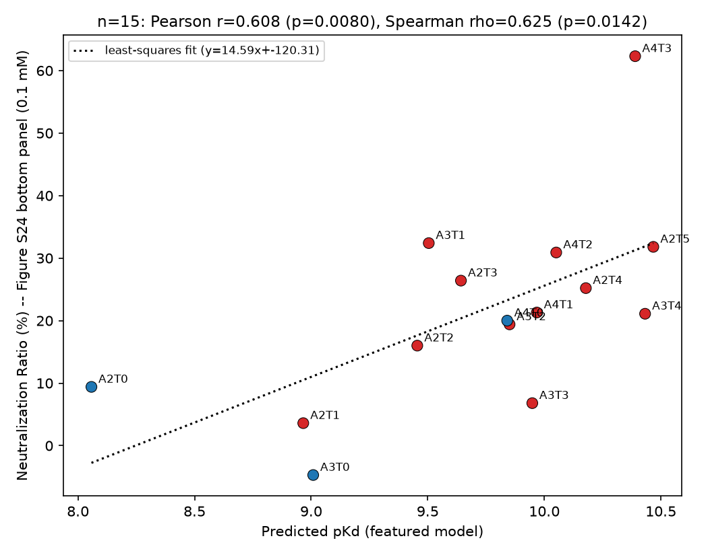

# T5ProtChem + Transformer-residual PPI/CPI Affinity Prediction

A pKd (binding affinity) predictor built on frozen, never-fine-tuned
T5ProtChem token embeddings: a small **trainable Transformer layer with a
residual connection back to the frozen embeddings**, followed by a
**per-token MLP whose scores are summed** over the sequence to produce the
final pKd. Trained on a pooled CPI (compound-protein interaction) + PPI
(protein-protein interaction) dataset, with PPI oversampled toward parity
with CPI via two complementary SMILES-splice augmentation schemes.

## Model

- **Encoder** (frozen): T5ProtChem's native char-level T5 encoder
  (`use_lora=False`), constructed directly from the raw pretrained
  checkpoint — **not** contact-map pretrained, **not** pKd fine-tuned. Both
  sides of a pair (protein sequence / small-molecule SMILES) are encoded
  independently and their token embeddings concatenated into one sequence.
- **Transformer** (trained, random init): a single `nn.TransformerEncoderLayer`
  (nhead=8, dim_feedforward=1024, dropout=0.1) self-attends over the full
  concatenated token sequence — it always sees the complete pair, with no
  contact restriction.
- **Residual connection**: the Transformer's output is added back to the
  *original* frozen token embeddings (no LayerNorm at this join).
- **Per-token MLP** (trained): `Linear(640→256)→ReLU→Dropout→Linear(256→64)→
  ReLU→Dropout→Linear(64→1)` maps each residual token to a scalar. Summing
  all scalars over the sequence gives the pKd prediction (**FULL-SUM**).
- **Contact-consistency auxiliary loss**: for the subset of rows with a real
  PDB structure (4.5Å heavy-atom contact residues/atoms extracted upstream),
  the *same* per-token scores are additionally summed over **only the
  contact-marked tokens** (**CONTACT-SUM**), and both sums are supervised
  against the same pKd during training. This is a secondary training signal
  only — the headline numbers below are all FULL-SUM (CONTACT-SUM never
  reaches competitive accuracy on its own; see `results/ablation_metrics.json`
  for both).
- **Data augmentation** (train set only): PPI-origin rows are oversampled
  toward a ~1:1 CPI:PPI ratio using two schemes depending on whether real
  contact data is available for that row (see Data / split below):
  - *Contact-biased splice* (`PDB_bind_PP` rows with usable contact data):
    3-8 residues per chain are replaced by their free-amino-acid SMILES
    fragment, sampled preferentially from the row's own contact residues —
    every contact residue (spliced or not) is still tracked into the
    contact mask described above.
  - *Random splice* (all other PPI rows — `PPB_affinity`, and the handful of
    `PDB_bind_PP` rows without usable contact data): same splice mechanism,
    uniformly random residue selection (no contact bias possible).

  Both schemes jitter pKd by ±5% per augmented copy. val/test are always
  clean/unaugmented.

## Data / split

Source datasets and the two-step split pipeline
(`scripts/make_pure_random_split_uniqueonly.py` → `scripts/trim_split_to_used_rows.py`)
are unchanged from before — see the file list and pipeline description in
git history / `data/`. The 3 split CSVs checked into `data/` are the same
ones used here; only what happens to the **train** portion at training time
changed (real-time augmentation, described above and reproduced by the
scripts below).

Row counts:

| | CPI | PPI (original) | PPI (contact-splice, factor=6) | PPI (random-splice, factor=6) | total used |
|---|---|---|---|---|---|
| train | 24,241 | 3,587 | 8,292 (from 1,382 rows w/ contact) | 13,230 (from 2,205 rows w/o contact) | 49,350 |
| val | 3,019 | 448 | — (clean) | — (clean) | 3,467 |
| test | 3,065 | 426 | — (clean) | — (clean) | 3,491 |

Train-set PPI total after augmentation is 25,109 vs. CPI's 24,241 (ratio
1.036) — effectively balanced. Of the 49,350 train rows, 17,470 also carry
a contact mask (9,178 from real PDB structures already in the base pool +
8,292 from the contact-biased splice copies) and contribute the auxiliary
CONTACT-SUM loss term described above.

## Results

Single held-out split (`scripts/train_balanced.py`, see `results/metrics.json`):

| | overall | CPI | PPI |
|---|---|---|---|
| val Pearson r | 0.668 | 0.648 | 0.651 |
| test Pearson r | 0.710 | 0.663 | 0.715 |
| val RMSE | 1.330 | 1.266 | 1.700 |
| test RMSE | 1.302 | 1.238 | 1.693 |

**CPI-only / PPI-only ablation** (same split, same architecture/augmentation
recipe, but trained on only CPI-origin or only PPI-origin train rows — see
`scripts/train_cpi_only.py` / `train_ppi_only.py`, `results/ablation_metrics.json`).
Both models are additionally applied to the FULL val/test set (both
origins), not just their own training domain, to see how well a
single-domain model transfers to the domain it never saw:

CPI-only model:

| | overall | CPI | PPI |
|---|---|---|---|
| val Pearson r | 0.081 | 0.682 | 0.058 |
| test Pearson r | 0.003 | 0.686 | 0.072 |
| val RMSE | 2.982 | 1.218 | 7.669 |
| test RMSE | 3.110 | 1.205 | 8.295 |

*The CPI column is this model's actual training domain. The overall/PPI
columns are this CPI-only model run out-of-domain on PPI rows it never
trained on — performance collapses on PPI (r drops to ~0.06-0.07, RMSE
roughly 6-7x higher than in-domain), dragging the "overall" number down to
near zero.*

PPI-only model:

| | overall | CPI | PPI |
|---|---|---|---|
| val Pearson r | 0.263 | 0.147 | 0.628 |
| test Pearson r | 0.286 | 0.123 | 0.692 |
| val RMSE | 2.534 | 2.635 | 1.711 |
| test RMSE | 2.605 | 2.709 | 1.667 |

*Same logic in reverse: the PPI column is this model's real training
domain. Run out-of-domain on CPI, it's weak (r ≈ 0.12-0.15) though not
quite as degenerate as CPI-only's transfer to PPI.*

Compared to the combined (featured) model's own CPI/PPI columns above (val
0.648/0.651, test 0.663/0.715), each single-domain model roughly matches
the combined model **within its own domain**, but transfers only weakly to
the other domain — consistent with the earlier XGBoost-based version of
this repo, the two tasks still appear to be learned largely independently
even when trained together.

### External validation (out-of-domain)

Predictions for an independent, out-of-domain polymer-peptide dataset
(`scripts/predict_hoshino.py`, results in
`results/predicted_pKa_KanM_balanced.csv`), correlated against an
experimentally measured neutralization-ratio readout for the same pairs.
Figure S24 of the source paper reports this neutralization ratio at three
ligand concentrations; all three are checked here (values pixel-extracted
from the supplementary PDF — bar-color detection + y-axis box-border
calibration). p-values are from PERMUTATION tests (99999 resamples) rather
than parametric/asymptotic approximations, since n=15 is too small for the
assumptions behind those to be reliable:

| ligand concentration | Pearson r | p (permutation) | Spearman rho | p (permutation) |
|---|---|---|---|---|
| 0.1 mM | 0.608 | 0.0080 | 0.625 | 0.0142 |
| 0.3 mM | 0.637 | 0.0113 | 0.567 | 0.0293 |
| 1.0 mM | 0.677 | 0.0087 | 0.381 | 0.1617 |



**Caveat**: earlier robustness checks on prior model variants in this
project (reshuffling the train/val/test partition and refitting) have
repeatedly found this kind of small-n (n=15) external correlation to be
**unstable across seeds** — a single favorable split can produce a
significant-looking result that doesn't hold up on average. The result
above is a single split and should be read accordingly, not as a validated,
reproducible effect. In-domain (val/test) performance has been consistently
strong and stable across every architecture/seed variant tried in this
project.

## Reproducing

```bash
python scripts/make_pure_random_split_uniqueonly.py     # source CSVs -> integrated_data_csv/split_pure_random_uniqueonly_{train,val,test}.csv
python scripts/trim_split_to_used_rows.py                # trims those down to data/split_pure_random_uniqueonly_{train,val,test}.csv (what's checked into this repo)
python scripts/extract_base_features.py                  # frozen-encoder features for the full split -> outputs/features_raw_concat_tokens_cache.pt
python scripts/extract_contact_masks.py                   # contact-token masks aligned to that cache -> outputs/contact_masks_for_full_tokens.pt
python scripts/extract_ppi_contact_splice_augmented.py    # PPI rows w/ contact data -> outputs/features_ppi_contact_splice_augmented_cache.pt
python scripts/extract_ppi_random_splice_augmented_nocontact.py  # PPI rows w/o contact data -> outputs/features_ppi_random_splice_augmented_nocontact_cache.pt
python scripts/train_balanced.py                          # featured model -> outputs/mlp_balanced.pt, results/metrics.json
python scripts/train_cpi_only.py                          # ablation -> outputs/mlp_cpi_only.pt
python scripts/train_ppi_only.py                          # ablation -> outputs/mlp_ppi_only.pt
python scripts/predict_hoshino.py                          # results/predicted_pKa_KanM_balanced.csv, results/hoshino_correlation.json
python scripts/plot_hoshino_scatter.py                     # results/hoshino_correlation_scatter.png
```

Scripts reference absolute paths from the original project layout (T5ProtChem
checkpoints, the contact CSVs used by `extract_contact_masks.py` /
`extract_ppi_contact_splice_augmented.py`, and an external polymer-affinity
validation CSV used by `predict_hoshino.py`) — update the path constants at
the top of each script for your own environment. The split CSVs are
included under `data/` so everything from `extract_base_features.py` onward
can be re-run without needing the raw source datasets at all; only
regenerating the split from scratch (the first two steps) needs them. The
T5ProtChem pretrained checkpoint, the PDB-derived contact CSVs, and the
external validation dataset are not included in this repo.
