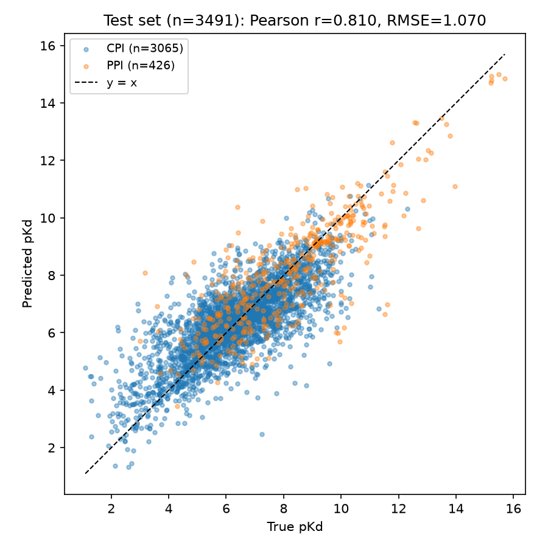

# T5ProtChem + XGBoost PPI/CPI Affinity Prediction

A "Boost" pKd (binding affinity) predictor: mean-pooled embeddings from a
**raw, never fine-tuned** T5ProtChem-native protein/molecule encoder, fed
into an XGBoost regressor. Trained on a pooled CPI (compound-protein
interaction) + PPI (protein-protein interaction) dataset, with a
leakage-conscious "pure" random split.

## Model

- **Encoder**: T5ProtChem's native char-level T5 encoder (`use_lora=False`),
  constructed directly from the raw pretrained checkpoint — **not**
  contact-map pretrained, **not** pKd fine-tuned. Both sides of a pair
  (protein sequence / small-molecule SMILES) are mean-pooled independently
  over their token embeddings and concatenated into a single feature vector.
- **Regressor**: XGBoost (`XGBRegressor`, 1000 max estimators, 30-round early
  stopping on a held-out validation set).
- **Data augmentation** (train set only): PPI-origin rows are oversampled
  toward a ~1:1 CPI:PPI ratio; each augmented copy replaces 12-32 residues
  per protein chain with their free-amino-acid SMILES representation
  ("ProtSMILES splicing") and jitters pKd by ±5%.

## Data / split

Source datasets: BindingDB, PDB-bind (protein-ligand and protein-protein
subsets), PPB-Affinity, Human/C. elegans, Negatome (see the wider project's
data curation pipeline — not included in this repo).

The split (`scripts/make_pure_random_split_uniqueonly.py`) is a **plain
row-level random split** (no protein-sequence-identity grouping, no CPI:PPI
balancing) — deliberately closer to how a naive practitioner might split
this kind of data — but with one fix applied *before* splitting: rows whose
(moleculeA, moleculeB) pair matches another row's swapped
(moleculeB, moleculeA) pair (both listing the same interaction in the two
possible chain orders) are deduplicated first, so no single underlying
interaction can leak across train/val/test through that route.

## Results

Single held-out split (`scripts/train_boost_t5protchem_raw_uniqueonly_quadsplice.py`,
see `results/metrics.json`):

| | overall | CPI | PPI |
|---|---|---|---|
| val Pearson r | 0.797 | 0.769 | 0.839 |
| test Pearson r | 0.810 | 0.771 | 0.829 |
| val RMSE | 1.069 | 1.056 | 1.153 |
| test RMSE | 1.070 | 1.045 | 1.233 |



### External validation (out-of-domain)

Predictions for an independent, out-of-domain polymer-peptide dataset
(`scripts/predict_hoshino_t5protchem_raw_uniqueonly_quadsplice.py`, results
in `results/predicted_pKa_KanM_T5ProtChem_raw_uniqueonly_quadsplice.csv`),
correlated against an experimentally measured neutralization-ratio readout
for the same pairs (`scripts/correlate_hoshino_t5protchem_raw_uniqueonly_quadsplice.py`):

| | Pearson r | p |
|---|---|---|
| vs. neutralization ratio (n=15) | 0.643 | 0.0098 |

**Caveat**: a 10-seed robustness check (reshuffling the train/val/test
partition 10 times and refitting) found this external correlation is **not
stable** — across seeds the mean Pearson r was 0.18 (unbalanced) / -0.06
(balanced), both not significantly different from zero. The single-split
result above should be read as one favorable draw, not a validated,
reproducible effect. In-domain (val/test) performance was consistently
strong and stable across all seeds tested.

## Reproducing

```bash
python scripts/make_pure_random_split_uniqueonly.py   # builds the split CSVs
python scripts/train_boost_t5protchem_raw_uniqueonly_quadsplice.py
python scripts/predict_hoshino_t5protchem_raw_uniqueonly_quadsplice.py
python scripts/correlate_hoshino_t5protchem_raw_uniqueonly_quadsplice.py
python scripts/plot_test_scatter.py                   # re-extracts test features and plots results/test_scatter.png
```

Scripts reference absolute paths from the original project layout (T5ProtChem
checkpoints, the integrated CPI/PPI CSV pool, and an external polymer-affinity
validation CSV) — update the path constants at the top of each script for
your own environment. Raw data, the T5ProtChem pretrained checkpoint, and the
external validation dataset are not included in this repo.
